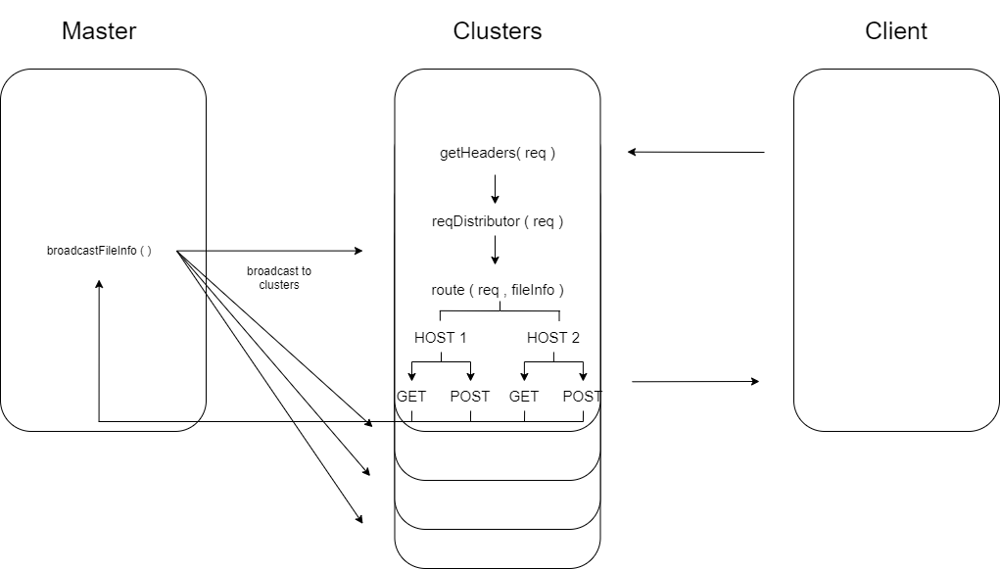

# Simple Web Server  

### Language
- Node.js
### Library
- Net Module
- PM2 (for clustering)
### How to start
1. Clone this repository
2. ```cd node_server```
3. ```npm install```
4. ```npm install pm2```
5. ```pm2-dev index.js```

### How to test out
1. Get files from the server (example text file)  
    1. Type ```host1.localhost/files/localfile.txt ``` on a browsesr
    2. The server'll give you a text file

2. Redirection  

    1. Open a browser, and the developer tool  
    2. Type ```host1.localhost/redir ```  
    3. The server will give you 301, 302, and 200 response with a landing page 
    
2. Caching 
    1. Open a 'new window' and a 'secret window' (with developer tools opened)
    2. Type ```host1.localhost/files/image1.png ``` in a new window  
    3. Type ```host1.localhost/files/image2.png ``` in a secret window  
    4. Repeat "ii" and step "iii" one more time.
    5. You'll see 304 responses on those two windows

3. Virtual Hosting  
    - Type ``` host2 ``` instead of ``` host1 ``` in all the steps above  
  
### How it works

#### 1. Initiates clusters
#### 2. When it gets request, it stores request headers and bodies
#### 3. Generates responses for different types of requests, such as :  
- Re-direction
- Local file requests
- Cache control
- Query strings 
  
#### 4. When client requires cache control, it broadcasts the file information to all clusters (with PM2)
#### 5. Send response to the client

#
### Diagram

